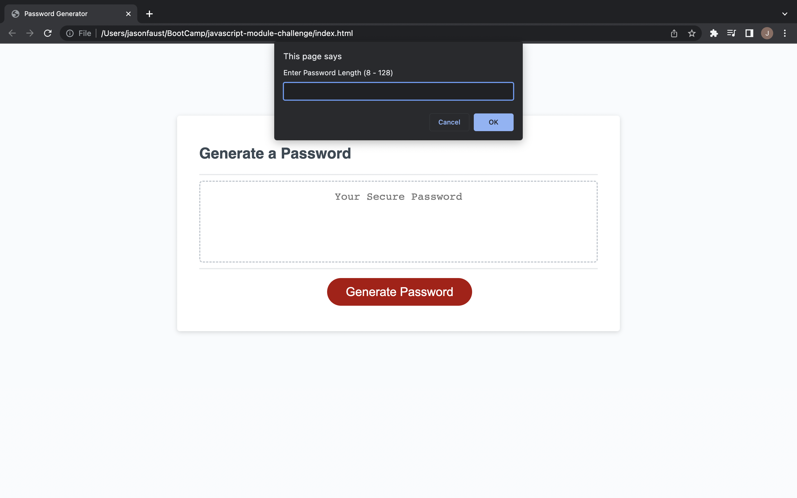

# JavaScript Random Password Generator

## Purpose

The purpose of this project was to create a random password generator using JavaScript to generate a strong password.  Using prompts to ask the user what criteria they would like to generate a password that meets their criteria to provide greater security.  

## JavaScript

The following was added to the JavaScript file to help with randomizing the password, as well as asking for the requirements for the password from the user:

* Set up variables for the different password options users can choose from: 
    * UpperCase
    * LowerCase
    * Numerical
    * Special Characters

* While loop set up to check on prompt for character length to check that user is entering between 8 and 128 characters, and that the value entered is a numeric value.

* Additional While loop added to confirm with the user additional character types that they would like to use with their password. 

* Function to generate password includes 'if statement' to declare what variables to use as the source characters for the password that the user can include

* 'For Loop' created to randomize the character types that the user selected. 

* Window prompt, alert and confirm method used to get user information on character types and length that should be used for a password.

* Math Floor and Math Random methods used to randomize source characters that the user selected.

## GitHub and Website Links

[GitHub](https://github.com/j-faust/javascript-module-challenge)

[Random Password Generator Webpage]()

## Web Page Screenshots

